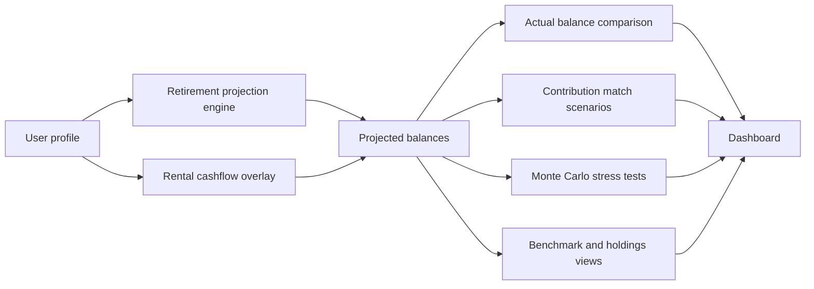

# 💼 Retirement Calculator


Track retirement projections, compare them to real balances, and stress-test the plan with individual and household Monte Carlo scenarios.

This app is built for one practical question: **How is the plan actually holding up over time?**

---

## Why this project exists

Retirement planning usually gets split across spreadsheets, account portals, and one-off calculators. This dashboard brings the main moving parts together:

- **projected vs actual** retirement balances
- **baseline vs contribution-boost** scenarios
- **individual vs household** stress testing
- **long-range planning vs live account context**

---

## What it does

| Feature | What you get |
| --- | --- |
| Retirement projections | Multi-account projection engine for `401k` and `roth_ira` planning |
| Actual balance tracking | Store yearly snapshots and compare them to modeled balances |
| Match scenarios | Overlay `+3%` and `+5%` employee contribution scenarios |
| Monte Carlo stress testing | Run individual and joint household retirement simulations |
| Live holdings | View current-phase holdings data for a user |
| Benchmark comparison | Compare recorded portfolio performance against a Boglehead-style benchmark |
| File vault | Upload and organize retirement, tax, estate, and legal documents |
| Secure access | Basic auth, security headers, and request rate limiting |

---

## Snapshot



---

## Tech stack

- **Backend:** FastAPI
- **Database:** SQLite locally, PostgreSQL in production
- **ORM:** SQLAlchemy
- **Templates:** Jinja2
- **Charts:** Chart.js
- **Rate limiting:** SlowAPI
- **Tests:** Pytest

Key entry points:

- [app/main.py](app/main.py)
- [start_web.ps1](start_web.ps1)
- [Procfile](Procfile)

---

## Quick start

### Option 1: easiest path

```powershell
cd retirement-calculator
.\start_web.ps1
```

### Option 2: manual setup

```powershell
cd retirement-calculator
python -m venv venv
.\venv\Scripts\Activate.ps1
pip install -r requirements.txt
uvicorn app.main:app --reload --port 8000
```

Open:

- `http://localhost:8000/`
- `http://localhost:8000/health`

---

## Environment variables

### Auth

Set these outside local development if you want authenticated access:

- `AUTH_STEVEN_PASSWORD`
- `AUTH_ALYSSA_PASSWORD`
- `AUTH_GUEST_PASSWORD`

### Database

- `DATABASE_URL` — optional locally, typical in production

### File uploads

- `UPLOAD_DIR` — optional custom storage location for uploaded documents

If `DATABASE_URL` is not set, the app uses local SQLite by default.

---

## API surface

### Page + health

- `GET /`
- `GET /files`
- `GET /health`

### Projection endpoints

- `GET /api/comparison/{username}`
- `GET /api/match-scenarios/{username}`
- `GET /api/comparison-all`

### Actual balance endpoints

- `POST /api/balances/{username}`
- `GET /api/balances/{username}`
- `GET /api/balances/record/{balance_id}`
- `PUT /api/balances/{balance_id}`
- `DELETE /api/balances/{balance_id}`

### Stress test endpoints

- `GET /api/stress-test/{username}`
- `POST /api/stress-test/{username}/recalculate`
- `GET /api/stress-test/joint-result?usernames=...`
- `POST /api/stress-test/recalculate-joint`

### Additional data endpoints

- `GET /api/holdings/{username}`
- `GET /api/benchmark/{username}/{year}`

---

## Project layout

```text
retirement-calculator/
├─ app/
│  ├─ main.py              # FastAPI app setup
│  ├─ auth.py              # Basic auth and roles
│  ├─ database.py          # engine, sessions, initialization
│  ├─ models.py            # SQLAlchemy models
│  ├─ routes/              # dashboard and API routes
│  ├─ services/            # projections, comparisons, benchmarks, Monte Carlo
│  ├─ static/              # CSS and JavaScript
│  └─ templates/           # Jinja templates
├─ data/                   # seed data, uploads, benchmark cache inputs
├─ lib/                    # projection logic and core calculators
├─ scripts/
├─ tests/
├─ requirements.txt
└─ start_web.ps1
```

---

## Core assumptions

- Baseline planning centers on `401k` and `roth_ira` account paths.
- Match scenarios increase employee `401k` contribution rates by `+3%` and `+5%`.
- Actual balances are stored separately so projections and real snapshots can be compared directly.
- Household stress testing uses shared Monte Carlo logic with correlated shocks.
- The planning view can extend through retirement using withdrawal assumptions.
- Benchmark comparisons use cached market data for repeatable year-based portfolio checks.

---

## Testing

```powershell
cd retirement-calculator
.\venv\Scripts\python.exe -m pytest -q
```

---

## Deployment notes

This project is ready for simple platform deployment.

- [Procfile](Procfile) starts `uvicorn`
- PostgreSQL is supported through `DATABASE_URL`
- uploads can be redirected with `UPLOAD_DIR`
- startup initializes tables and seed data when needed

Good fit for platforms like Railway.

---

## Best for

- tracking retirement progress against a living plan
- comparing actual balances to projected balances over time
- testing contribution increases quickly
- viewing household retirement risk without spreadsheet sprawl
- keeping important planning documents in one place

## Not trying to be

- a full tax-optimization engine
- advisor-grade fiduciary guidance
- a complete model of every retirement variable
- a guarantee of portfolio outcomes or retirement success

---

## In one line

**A focused FastAPI retirement dashboard for projections, actual balance tracking, contribution scenarios, household stress testing, and planning visibility.**

